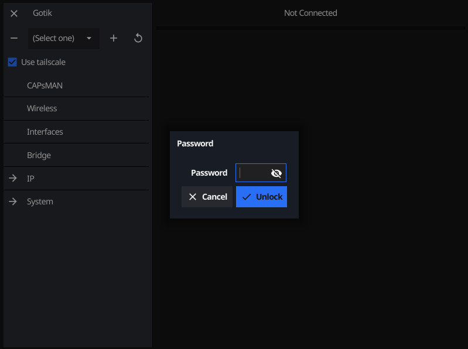

# gotik
Fyne Mikrotik router - cross platform browsing application

gotik support both Intel and Arm platform. It is also running on Windows, MacOS, Linux, FreeBSD, iOS and Android.

## Screenshot



## Installing from source

Install fyne following [this direction](https://developer.fyne.io/started). If you want to build *gotik* for different OS/Architecture, I recommend to also install fyne-cross with podman or docker.

Now in a directory where you are ok installing the source code, you can do:
```
$ git clone https://github.com/Bluebugs/gotik
$ cd gotik
$ fyne install
```

## Installing from binary

Download the right binary for your computer [here](https://geoffrey-artefacts.fynelabs.com/github/Bluebugs/Bluebugs/gotik/latest/index.html)

### Running on macOS arm64 (M1/M2)

Binaries that are not signed with an official Apple certificate and downloaded from the web are put into quarantine by macOS (Apple computers with Intel CPUs do not exhibit this behavior). To solve this, you need to remove the quarantine attribute from the application (replacing <path to .app> with the application path):

xattr -r -d com.apple.quarantine <path to .app>

If this does not work, the amd64 binaries work fine through Rosetta.

## Contribution

This software is open source, feel free to contribute! Not just code, but reporting issues, suggesting ideas, improving documentation or marketing material.

An easy place to start contributing is in `routeros.go` which describe all the view of the application and there is a lot of entry to add! Please feel free to contribute the entry for the page you are missing.

Currently only table view are implemented, but view with just information in labels should be straight forward to add along the same principle as for table. It might be good to start there before attempting to add support for actions.

An additional area of welcome improvements would be to add tests. Ideally it should be possible to emulate a defined routeros configuration and verify that the UI match it properly. It should be possible to control and modify the state of the router to verify the UI react appropriately.
